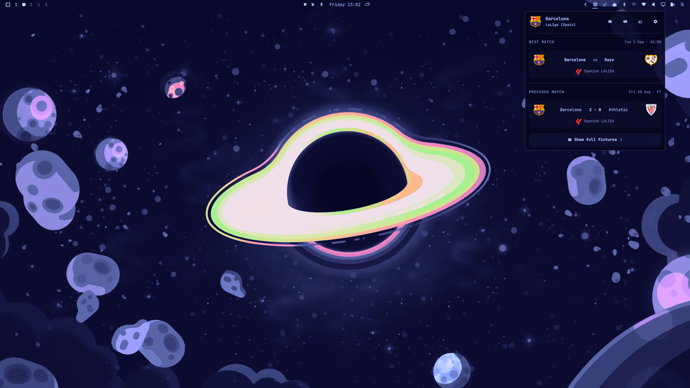

# FutBar — Football Widget for Omarchy


[](LICENSE)
[](manifest.json)

**FutBar** is a live football companion and match center engineered for Omarchy. Track live fixtures, tactical pitch formations with athlete kits, minute-by-minute match timelines, head-to-head records, league standings, player leaderboards, and real-time desktop event notifications seamlessly from your top bar. Powered directly by ESPN's public endpoints with zero API costs, no authentication keys, and no account setup required.



---

## Screenshots

| Club Overview | Tactical Pitch & Lineups |
| :---: | :---: |
|  |  |

| Match Statistics & Leaders | League Matchweek Fixtures |
| :---: | :---: |
|  |  |

| Player Stats & Leaderboards | Searchable Club Picker |
| :---: | :---: |
|  |  |

---

## Features

- **Top Bar Integration**: Minimalist soccer icon with live match state indicators, pulse animations during updates, and rich tooltip summaries on hover.
- **Comprehensive Match Center**: Live match scorecard, match status (pre-match, live, half-time, extra-time, penalties, full-time), goal scorers, and series notes.
- **Tactical Pitch & Lineups**: Full tactical pitch view featuring starting XI formations, athlete jersey kit numbers/graphics, substitutes, and live player ratings.
- **Match Timeline & Events**: Visual minute-by-minute timeline tracking goals, penalties, yellow/red cards, substitutions, and half-time/full-time milestones.
- **Head-to-Head & Team Form**: Detailed past encounter history, win/draw/loss counts, and recent form guide.
- **Live Text Commentary**: Reverse-chronological commentary feed with highlighted key match moments.
- **League Standings & Round Fixtures**: Comprehensive league tables with qualification and relegation zone highlights, plus matchweek round browsing.
- **Player Leaderboards**: Top scorers, assist leaders, and disciplinary card rankings.
- **Live Activity Match Tracking**: Toggle match following to receive instant desktop notifications (`notify-send`) on goals, cards, and period changes.
- **Seamless Club & League Switching**: In-panel search and dropdown picker to switch followed teams or browse across global competitions.

---

## Installation & Setup

### Install Plugin
```bash
omarchy plugin add https://github.com/AlwaysRead/omarchy-futbar-plugin.git --enable
```

### Position on Bar (Optional)
```bash
omarchy bar move devbook.futbar --section right
```

### Set Default Club & League (Optional)
You can choose your favorite team and league directly in the panel UI, or configure via CLI:
```bash
omarchy plugin config devbook.futbar set teamName "Barcelona" league "esp.1"
```

### Remove Plugin
```bash
omarchy plugin remove devbook.futbar
```

---

## Controls & Shortcuts

| Action | Shortcut / Control |
| :--- | :--- |
| **Open / Close Panel** | Click bar icon or configure custom Hyprland keybind |
| **Quick Tooltip** | Hover over bar icon for live scores & kickoff times |
| **Instant Refresh** | Middle-click bar icon |
| **Close Panel** | <kbd>Escape</kbd> |
| **Cycle Panels** | <kbd>Tab</kbd> / <kbd>Shift</kbd> + <kbd>Tab</kbd> |
| **Follow Match** | Click "Follow" button in match card or detail header |

---

## Optional Dependencies

- **`libnotify` (`notify-send`)**: Required for desktop match event notifications (goals, cards, half-time, full-time). Pre-installed on standard Linux desktop distributions (e.g. `libnotify` package).

---

## Popular League Codes

| League | ESPN Code |
| :--- | :--- |
| **Premier League** | `eng.1` |
| **LaLiga** | `esp.1` |
| **Serie A** | `ita.1` |
| **Bundesliga** | `ger.1` |
| **Ligue 1** | `fra.1` |
| **UEFA Champions League** | `uefa.champions` |
| **UEFA Europa League** | `uefa.europa` |
| **Major League Soccer (MLS)** | `usa.1` |
| **Brasileirão** | `bra.1` |
| **Eredivisie** | `ned.1` |
| **Liga Portugal** | `por.1` |

---

## License

This project is licensed under the [MIT License](LICENSE).