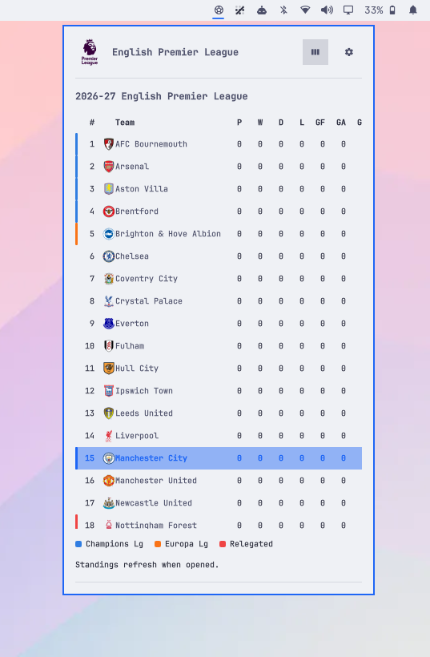

# FutBar — Omarchy Football Score Widget

[](https://omarchyplugins.com)
[](LICENSE)

**FutBar** is a third-party bar widget for the [Omarchy](https://omarchy.dev) desktop environment that tracks your favorite football (soccer) club. It displays live scores, match clocks, goal scorers, upcoming fixtures, past results, and live league standings directly in your top bar.

Data is fetched from ESPN's public sports API without requiring an API key.


---

## Screenshots

| Live Match Card | League Standings |
| :---: | :---: |
|  |  |

| Upcoming Fixtures (Void Dark) | Upcoming Fixtures (Void Light) |
| :---: | :---: |
|  |  |

| Live Activity Desktop Notification |
| :---: |
|  |

---

## Features

- **Compact Bar Widget**:
  - Displays a clean soccer icon that pulses gracefully while fetching data.
  - Middle-click to instantly refresh scores.
- **Rich Hover Tooltip**:
  - Hovering the icon shows the current match score, match clock, and a running event summary (goals, red cards, key events).
- **Interactive Fixture Panel**:
  - Click the bar icon to open a sleek popup card with full match details.
  - Displays team badges, competition logos, kickoff times, previous match results, and upcoming fixtures.
- **Live Standings Table**:
  - Toggle between fixtures and live league standings.
  - Highlights your favorite team with your Omarchy theme accent color.
  - Dynamic qualification zones (Champions League, Europa League, Conference League, relegation) indicated with color bars derived directly from live ESPN notes.
- **Built-in Team & League Picker**:
  - Select your favorite league and club using dropdowns directly inside the panel.
  - Persists your selection automatically so reloads never flash default teams.
- **Desktop Live Activity Notifications**:
  - Receive desktop notifications (`notify-send`) for kickoff, goals, red cards, half-time, and full-time events during live matches.

---

## Installation

Install directly via the `omarchy` CLI:

```bash
omarchy plugin add https://github.com/AlwaysRead/omarchy-futbar-plugin.git --enable
```

## Usage

- **Toggle Panel**: Click the soccer icon in the bar to open or close the fixture & standings panel.
- **Live Tooltip**: Hover the icon to see current score, match clock, and recent scorers.
- **Quick Refresh**: Middle-click the bar icon to refresh live fixtures immediately.
- **Keyboard Navigation**: Press <kbd>Escape</kbd> to close the popup, or <kbd>Tab</kbd> to cycle between open bar popouts.

## Placement & Removal

```bash
# Move widget to another bar section (left, center, right)
omarchy bar move devbook.futbar --section right

# Remove the plugin
omarchy plugin remove devbook.futbar
```

---

## Configuration & Supported Leagues

You can select your team directly from the **in-panel picker**, or set it via Omarchy Plugin Settings:

- **Team Name**: The name ESPN uses (e.g., `Barcelona`, `Arsenal`, `Real Madrid`, `Inter Miami`).
- **ESPN League Code**: The league identifier code.

### Popular League Codes

| League | ESPN Code |
| :--- | :--- |
| **Premier League** | `eng.1` |
| **LaLiga** | `esp.1` |
| **Serie A** | `ita.1` |
| **Bundesliga** | `ger.1` |
| **Ligue 1** | `fra.1` |
| **UEFA Champions League** | `uefa.champions` |
| **UEFA Europa League** | `uefa.europa` |
| **Eredivisie** | `ned.1` |
| **Primeira Liga** | `por.1` |
| **MLS** | `usa.1` |
| **Brasileirão** | `bra.1` |

### State & Storage Locations

- **Settings**: `~/.config/omarchy/shell.json` (inline plugin settings).
- **Favorite Store**: `~/.local/state/omarchy/futbar.json` (authoritative team state file across reloads).

---

## Security & Dependencies

- **Dependencies**: Uses Omarchy's built-in Quickshell modules (`Quickshell`, `Quickshell.Io`, `qs.Commons`, `qs.Ui`). Optional `notify-send` for desktop activity alerts.
- **Network Data**: Connects exclusively over HTTPS to public ESPN REST endpoints (`site.api.espn.com`). No tokens, authentication, or tracking needed.
- **Privilege Boundary**: Operates entirely within standard user privileges. All state is isolated to `~/.config/omarchy/plugins/devbook.futbar` and `~/.local/state/omarchy/futbar.json`.

---

## Polling Behavior

- **Live Match in Play**: Polls every **30 seconds**.
- **Standard Mode**: Polls every **5 minutes**.
- **Manual Refresh**: Middle-click the bar icon or tooltip to refresh immediately.

---

## Local Development & Validation

If you want to modify or test FutBar locally:

1. **Navigate to the repository directory**:
   Open a terminal in your local checkout of the plugin repository:
   ```bash
   cd omarchy-futbar-plugin
   ```

2. **Validate Manifest & QML**:
   ```bash
   # Validate Omarchy plugin manifest
   omarchy plugin validate .

   # Check QML syntax against Omarchy shell headers
   qmllint -I "$OMARCHY_PATH/shell" FutBar.qml FutBarPanel.qml
   ```

3. **Install & Hot-Reload**:
   ```bash
   # Copy to local Omarchy plugins directory
   mkdir -p ~/.config/omarchy/plugins/devbook.futbar
   cp FutBarPanel.qml FutBar.qml manifest.json ~/.config/omarchy/plugins/devbook.futbar/

   # Rescan plugins in Omarchy shell
   omarchy shell shell rescanPlugins
   ```

---

## Repository Structure

```
omarchy-futbar-plugin/
├── manifest.json       # Plugin metadata and entry points
├── FutBar.qml          # Bar widget component
├── FutBarPanel.qml     # Interactive fixture panel and standings view
├── README.md           # Project documentation
└── LICENSE             # MIT License
```

---

## License

Distributed under the [MIT License](LICENSE).